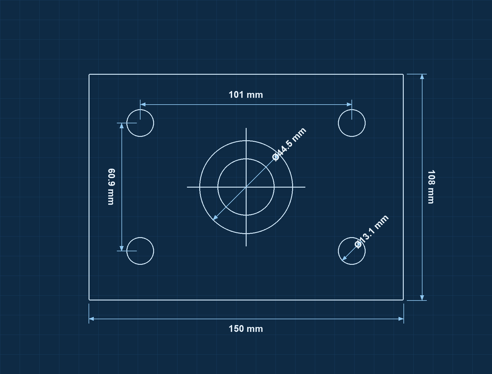

# SnapCAD — Snapshot to CAD

Convierte la **foto de una pieza mecánica/industrial** en un **plano técnico 2D**
acotado. Claude (Opus 4.8 Vision) analiza la imagen y devuelve la geometría
estructurada; el frontend dibuja el croquis y escala todas las cotas a partir de
una sola medida de referencia.



> Croquis del modo demo (sin API key) tras fijar **W1 = 150 mm** como referencia:
> el resto de las cotas se calculan automáticamente.

```
SnapCAD/
├─ backend/    FastAPI + Anthropic SDK (motor de análisis geométrico)
└─ frontend/   Vite + React + Tailwind (lienzo SVG acotado)
```

## Funciones

- 📷 Análisis de la foto con Claude Opus 4.8 Vision → geometría 2D estructurada.
- 📐 Croquis técnico con cotas estándar (flechas `<marker>`, texto centrado y rotado).
- 🔍 **Pan & zoom** en el lienzo (rueda para zoom hacia el cursor, arrastrar para mover, botón 1:1).
- ✏️ **Editar cotas**: renombrar, eliminar, **arrastrar para reposicionar**, **mover los extremos** de una cota lineal, **agregar cotas** (2 clics con *snapping*) y **acotar diámetros** (clic en un círculo).
- ↶ **Deshacer / Rehacer** (Ctrl+Z / Ctrl+Shift+Z) coalescido por interacción.
- ⌨️ Atajos: **Supr** elimina la cota seleccionada, **Esc** cancela la herramienta / deselecciona.
- ⭐ Indicador de la **cota de referencia** y lector de **zoom %**.
- 📏 Escala automática a partir de una sola medida de referencia.
- 🎨 Temas Blueprint / Blanco.
- 💾 Exportar a **SVG** y **PDF vectorial** (con respaldo rasterizado).
- 🧪 **Modo demo** sin API key (botón "Ver ejemplo").

## El "truco de la escala"

1. Claude devuelve la geometría en un **espacio de píxeles normalizado** (lado
   mayor = 1000 px) y una lista de **cotas candidatas**, cada una con su longitud
   en píxeles `px`.
2. El usuario hace clic en una cota e introduce su medida real en **mm**.
3. `ratio = mm / px` → todas las demás cotas se recalculan como `px × ratio`.

## Requisitos

- Python 3.10+
- Node.js 18+
- Una API key de Anthropic

## 1) Backend

```bash
cd backend
python -m venv .venv
# Windows:  .venv\Scripts\activate
# macOS/Linux:  source .venv/bin/activate
pip install -r requirements.txt

cp .env.example .env        # y pon tu ANTHROPIC_API_KEY
uvicorn main:app --reload --port 8000
```

Comprobación: <http://localhost:8000/api/health>

## 2) Frontend

```bash
cd frontend
npm install
npm run dev
```

Abre <http://localhost:5173>. El dev-server hace proxy de `/api` al backend
(puerto 8000), así que no hace falta configurar nada más en desarrollo.

## Flujo de uso

1. Arrastra una foto de la pieza.
2. Claude detecta la geometría y se dibuja el croquis.
3. Selecciona una cota (en el plano o la lista) e introduce su medida real en mm.
4. Todas las cotas se actualizan automáticamente.
5. Descarga el plano en **SVG** o **PDF**.

## Notas técnicas

- **Salida estructurada garantizada:** el backend usa `output_config.format` con
  un JSON Schema, de modo que la respuesta del modelo siempre es JSON válido y
  parseable (requisito de manejo de errores).
- **Cotas estándar:** el SVG usa elementos `<marker>` para las flechas y rota el
  texto de cada cota para que quede centrado y legible sobre la línea, según la
  norma de dibujo técnico.
- **Modelo:** `claude-opus-4-8` por defecto (configurable con `SNAPCAD_MODEL`).
